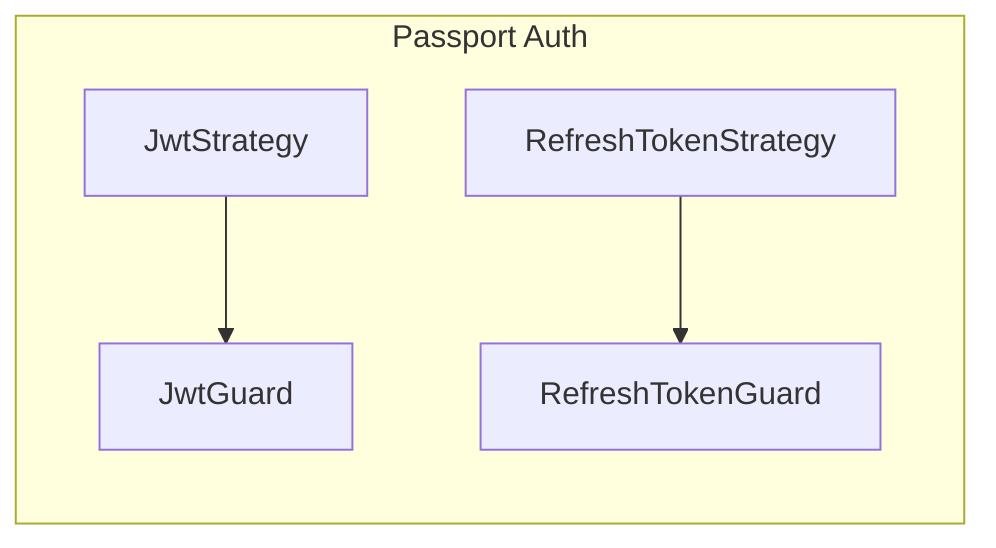

# Auth

A global `APP_GUARD` is used for the JwtStrategy whereas the `@UseGuards(RefreshTokenGuard)` decorator is used to protect the `authRefreshTokens` route. It should only be accessible to users who have a valid refresh token.
