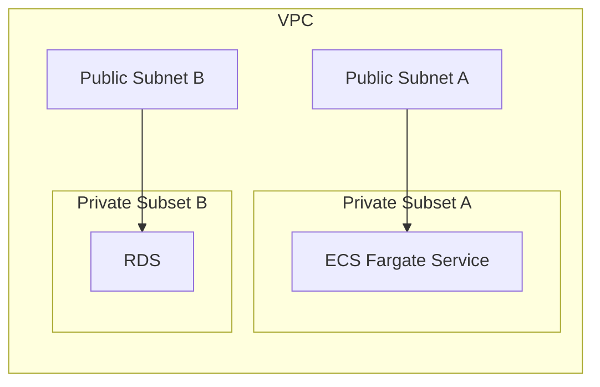

# Infra

All managed [Pulumi](https://www.pulumi.com/).

## AWS Config

After installing the AWS CLI, add the config below to `~/.aws/config` and `aws sso login --sso-session=onex` login you in.

```toml
[sso-session onex]
sso_start_url = https://ocorp.awsapps.com/start
sso_region = ap-southeast-2

[profile onex-dev]
sso_session = onex
sso_account_id = <account_id>
sso_role_name = AdministratorAccess
region = ap-southeast-2

[profile onex-prod]
sso_session = onex
sso_account_id = <account-id>
sso_role_name = AdministratorAccess
region = ap-southeast-2
```

## Architecture

Each instance should be live within a subnet of the VPC. Security groups should be used to control traffic to/from all resources.


