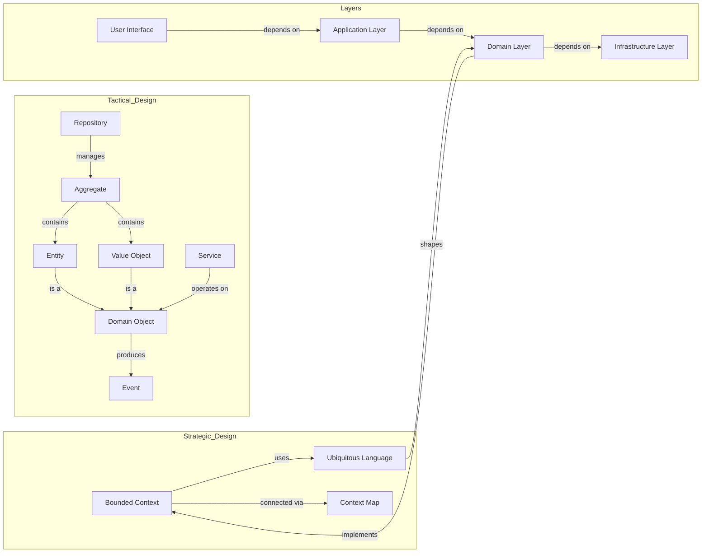

# Domain Driven Design

The number of lines $n$ of a code base scales, so does its complexity. Badly architected code often scales quadratically $O(n^2)$. Some codebases can even grow cubically $O(n^3)$.

This library is a collection of tools to prevent that from happening. Heavily based on Eric Evans's book "Domain Driven Design" and the SOLID principles.



## Ubiquitous Language

A ubiquitous language is a shared language that is used by the domain experts and the developers. It is a language that is used to describe the domain in a way that is easy to understand for both the domain experts and the developers.

> The ubiquitous language is the foundation of the domain-driven design. It is a vernacular between domain experts and the developers.

## Elements

### Bounded Context

A bounded context is a boundary within which a shared language can be used. It is a context that is relevant to a specific business or project. Context boundaries should ensure models remain independent and within their context.

### Entities and Value Objects

- Entities have unique identities and change over time `User` or `Order`
- Value objects are immutable and defined by attributes `Money` or `Address`

### Aggregate

An aggregate is a cluster of domain objects that are bound together by a root entity i.e., an aggregate root.

In the following example `Order` is the aggregate root responsible for ensuring there is at least one `OrderItem` entity per order.

```ts
interface OrderItem {
  id: string;
  name: string;
}

interface Order {
  id: string;
  items: [OrderItem, ...OrderItem[]];
}
```

### Domain Events

Events model data flow through the business domain `OrderPlaced`, `OrderReceived`, etc.

```ts
class DomainEvent<T = unknown> {
  public readonly id: string = uuid();
  public readonly name: string;
  public readonly data: T;
  public readonly aggregatedId: string;
  public readonly aggregateType: string;
  public readonly timestamp: Date = new Date();
  public readonly actor: DomainEventActor;

  // ...
}
```

Domain event actors are distinct roles any user can take

```ts
type DomainEventActor =
  | {
      userId: string;
    }
  | {
      system: true;
    };
```

## Layers

### Domain Layer

The domain layer is the core of the application. It contains the business rules and logic.

### Application Layer

The application layer is responsible for orchestrating the domain layer. It contains the business logic and the application-specific code.

### Infrastructure Layer

The infrastructure layer is responsible for providing the necessary persistent storage systems for the application. It contains the code for the database, the web server, the message queue, etc.

Repositories are the beginning of the lifecycle of an aggregate. Once a factory creates an aggregates it is passed through the services in the application layer where business logic is executed.