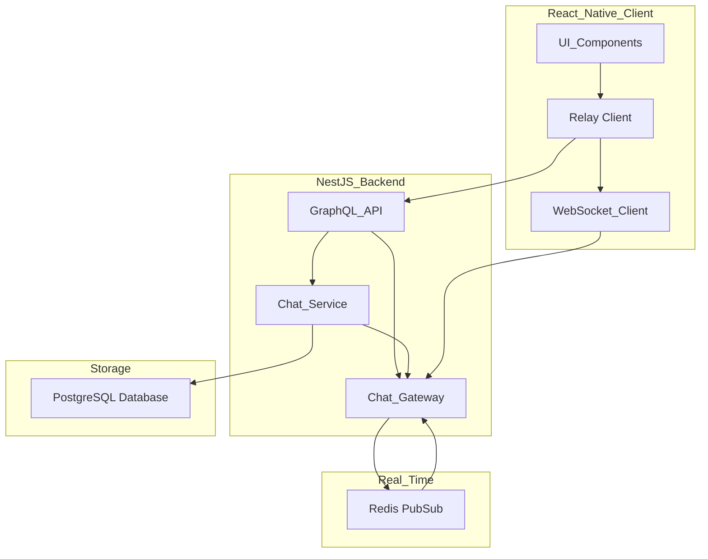

# oChat

```mermaid
graph TD
    subgraph React_Native_Client
        A[UI_Components]
        B[Relay Client]
        C[WebSocket_Client]
        A --> B
        B --> C
    end

    subgraph NestJS_Backend
        D[GraphQL_API]
        E[Chat_Service]
        F[Chat_Gateway]
        D --> E
        D --> F
        E --> F
    end

    subgraph Storage
        H[PostgreSQL Database]
    end

    subgraph Real_Time
        G[Redis PubSub]
    end

    B --> D
    C --> F
    E --> H
    F --> G
    G --> F
```

