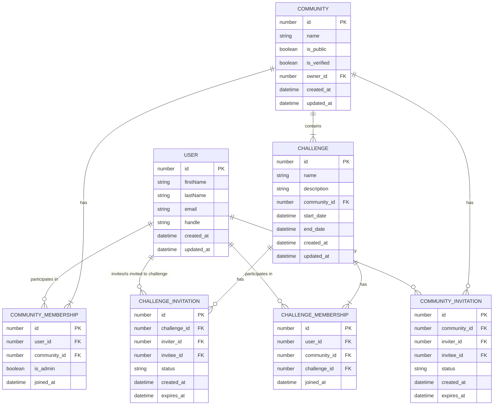
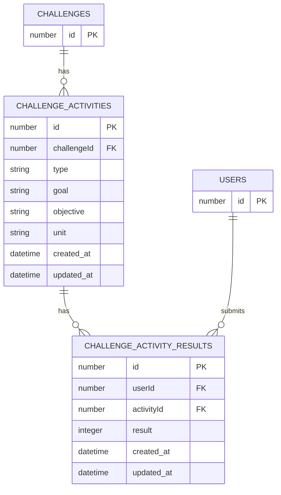

# Data Model

The data model is segmented into constituent entities: users, communities, and challenges. These entities are important to understand as they form the basis of the codebases's naming conventions and structure, as per Domain Driven Design (DDD).



## Communities

There are two types of communities: public and private. Public communities are open to everyone, while private communities require an invitation to join.

### Community Membership

Users can be invited to both a public or private community. A user can either accept or decline an invitation. If the user accepts the invitation, they are added to the community. If they decline, the invitation is not removed but marked as declined. An invitation also has an expiry date (e.g. 7 days). Invitations have three states: `pending`, `accepted`, and `declined`.

### Community Roles

Communities have admins/chiefs/bosses (still deciding on the official name). These are users that have special permissions to manage the community. They can invite users, create challenges, and manage the community settings. Such users can nominate other users to become admins. The concept of an owner is the equivalent to a superadmin. There can only be one owner per community, they can demote or remove any admin.

A community can host multiple challenges. Challenges have a start and end date, and a description. Users have to be part of a community to join the challenges hosted by that community. By default you are not part of a challenge when you join a community, you must join that challenge.

## Challenges

### Challenge Membership

A user must be a member of a community to join their challenge(s). If a user is invited to a community's challenge without being a member, they must first join the community.

### Challenge Roles

Challenge roles are inherited from community roles so the system doesn't explode with complexity.

Q: Should only admins create challenges? Or should any member be able to create a challenge?

### Activities

The bread and butter of challenges are activities. This is where all the logic happens. Activities are the actual things you do in a challenge. There can be multiple activities in a challenge where the level of user customisation comes from concepts below.

To start off, one activity per challenge will keeps simple. However, we want hosts to feel they have the freedom to create diverse challenges with multiple activities.



#### Activity Types

Users can create a challenge from the following activity types:

- Repetitions
- Weightlifting
- Time-Based
- Distance
- Social

Each of these activities can have a different unit of measurement:

- kg
- lb
- m
- ft
- seconds
- minutes
- hours
- mi
- km
- %

We build internal mappings to ensure the correct units are linked to the correct activity types e.g.

```ts
const activityUnitsMap = {
  "Repetitions": [],
  "Time-Based": ["seconds", "minutes", "hours"],
  "Weightlifting": ["kg", "lb"],
  "Distance": ["m", "km", "mi", "ft"],
  "Social": [],
};
```

#### Activity Goals

Goals are what communities measure to determine the success of a challenge. We currently offer the following goal types:

- Count-Based
- Duration
- Improvement Over Time

Each goal has constituent types that help specify the goal:

- Lowest Number
- Highest Number
- Shortest Time
- Longest Time
- Most Improved
- Specific Target

Similarly this is our internal mapping to ensure the correct goals are linked to the correct goal types:

```ts
const goalTypesMap = {
  "Count-Based": ["Lowest Number", "Highest Number", "Specific Target"],
  "Duration": ["Shortest Time", "Longest Time"],
  "Improvement Over Time": ["Most Improved", "Specific Target"],
};
```

This information gives us the ability to offer a dynamic set of options for users to choose from when creating a challenge. Here are some examples:

- "The One Rep Max": Repetitions, Count-Based, Highest Number
- "The Fastest 5k": Time-Based, Duration, Shortest Time
- "The Heaviest Deadlift": Weightlifting, Count-Based, Specific Target, 100 kg
- "The Intense Run": Distance, Improvement Over Time, Most Improved
- "The Most Improved Bench Press": Weightlifting, Improvement Over Time, Specific Target, 30 %
- "The Coffee Run": Social

#### Results

Activities are templates for collecting results. Once a challenge's activity is created we use the units and goal types to infer what the user should record. Results are recorded into the activity results table.
