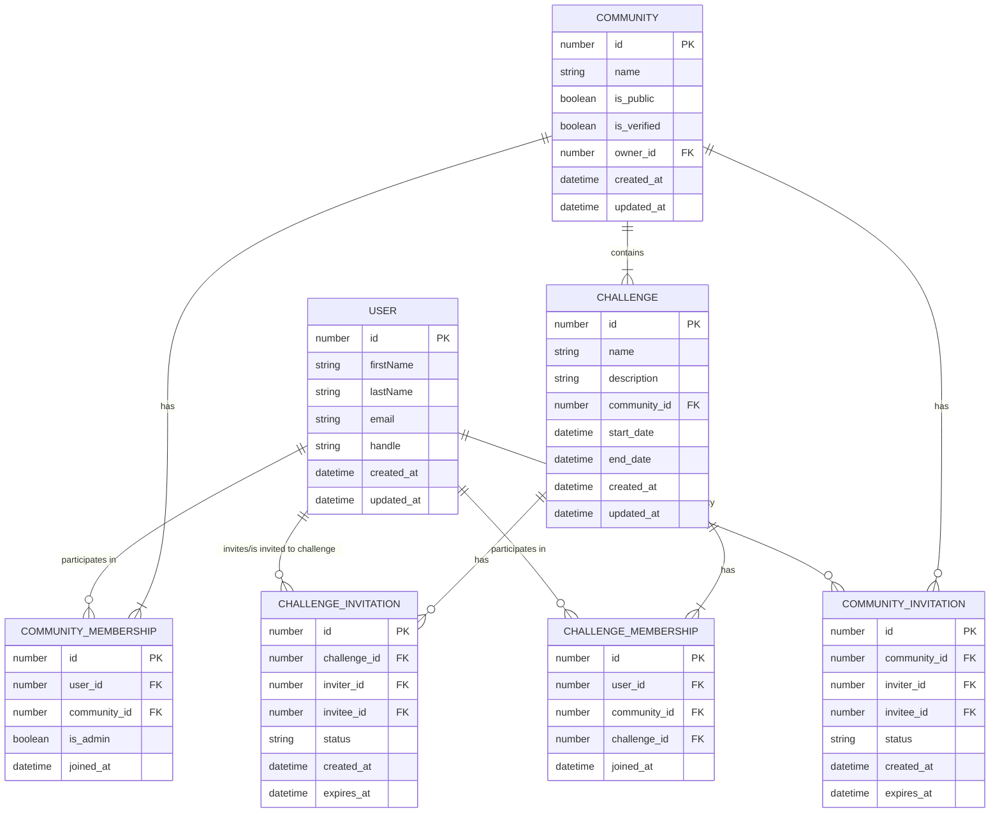

# Data Model

The data model is segmented into constituent entities: users, communities, and challenges. These entities are important to understand as they form the basis of the codebases's naming conventions and structure, as per Domain Driven Design (DDD).

## Communities

There are two types of communities: public and private. Public communities are open to everyone, while private communities require an invitation to join.

### Community Membership

Users can be invited to both a public or private community. A user can either accept or decline an invitation. If the user accepts the invitation, they are added to the community. If they decline, the invitation is not removed but marked as declined. An invitation also has an expiry date (e.g. 7 days). Invitations have three states: `pending`, `accepted`, and `declined`.

### Community Roles

Communities have admins/chiefs/bosses (still deciding on the official name). These are users that have special permissions to manage the community. They can invite users, create challenges, and manage the community settings. Such users can nominate other users to become admins. The concept of an owner is the equivalent to a superadmin. There can only be one owner per community, they can demote or remove any admin.

A community can host multiple challenges. Challenges have a start and end date, and a description. Users have to be part of a community to join the challenges hosted by that community. By default you are not part of a challenge when you join a community, you must join that challenge.

## Challenges

### Challenge Membership

A user must be a member of a community to join their challenge(s). If a user is invited to a community's challenge without being a member, they must first join the community.

### Challenge Roles

Challenge roles are inherited from community roles so the system doesn't explode with complexity.

Q: Should only admins create challenges? Or should any member be able to create a challenge?
