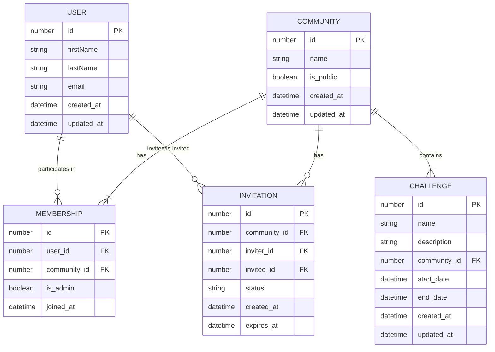

# Data Model

## Communities

There are two types of communities: public and private. Public communities are open to everyone, while private communities require an invitation to join.

Users can be invited to both a public or private community. Invitations should be stored in the database.

Communities have admins/chiefs/bosses (still deciding on the official name). These are users that have special permissions to manage the community. They can invite users, create challenges, and manage the community settings. Such users can nominate other users to become admins.

